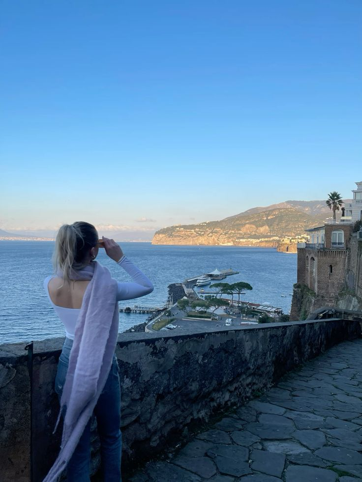

# CPE 322 Repository

**My name is Ryan Connolly. I am a 3/4+1 Computer Engineering major and Computer Science minor.**

*I really enjoy coding, and the first thing I ever coded was:* 

	`#include <iostream>
 	 using namespace std;
   
	 int main(){
  	 	cout << "hello world" << endl; }`

*in ENGR 116. It was the class that introduced me to coding, and I have loved it ever since!*

## 3 Things I Would Like to Accomplish This Semester:
1. Earn a 4.0 GPA.
2. Complete one solo coding project.
3. Stop procrastinating.

### Countries I Have Been To:
- Canada
- Antigua and Barbuda
- Trinidad and Tobago
- Italy
- France
> I hope to visit many more soon. I love to travel!
> I actually recently returned from a study abroad trip in Sorrento, Italy.
> The photo below is from my trip!

---
#### I look forward to having a great semester and meeting knew people!

This is my [LinkedIn Page](https://www.linkedin.com/in/ryanvconnolly/) to connect! 
