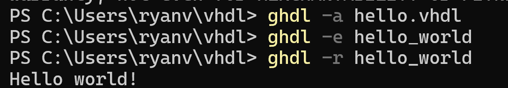

# CPE 322 Lab 1: GHDL and GTKWave
## Hello World Test

```ghdl -h  
 ghdl -v  
 ghdl -a hello.vhdl 
 ghdl -e hello_world 
 ghdl -r hello_world```




### 1. Half Adder Example


### 2. D Flip-Flop


### 3. 

