# CPE 322 Lab 2: Command Line

## 1. hostname
Prints the host name of the system being used.

## 2. env
Prints the environment variables.

etc. 

## 3. ps
Process status.

## 4. pwd
Prints name of current directory.

## 5. git clone https:/github.com/kevinwlu/iot.git
Clones repository from github into a new directory.

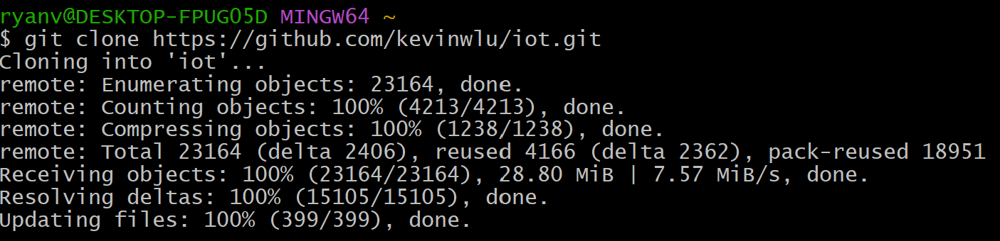

## 6. cd iot
Changes current directory to iot.

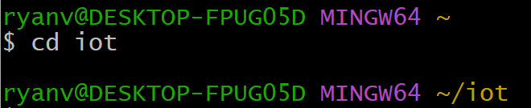

## 7. ls
Lists files inside directory.

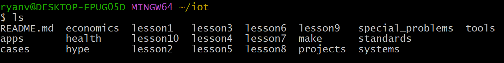

## 8. cd
Changes to home directory.

## 9. df
Displays info about total space and available space on the file system.

## 10. mkdir demo
Creates directory demo. No changes shown in terminal.

## 11. cd demo
Changes current directory to demo.

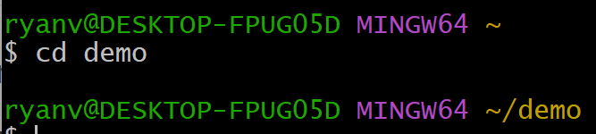

## 12. nano file
Opens a text editor to edit the file "file."

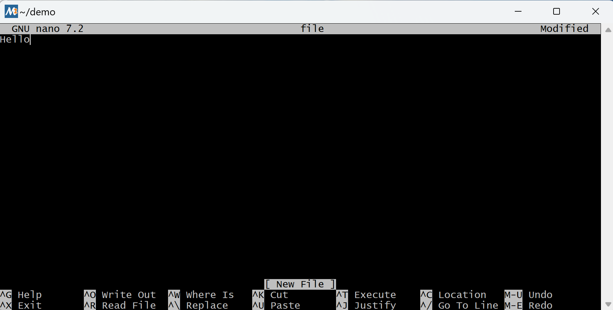

## 13. cat file
Prints the information in "file."

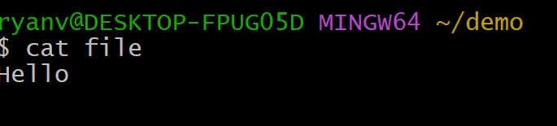

## 14. cp file file1
Copies "file" into "file1."

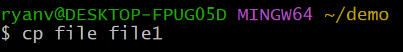

## 16. mv file file2
Renames "file" to "file2."

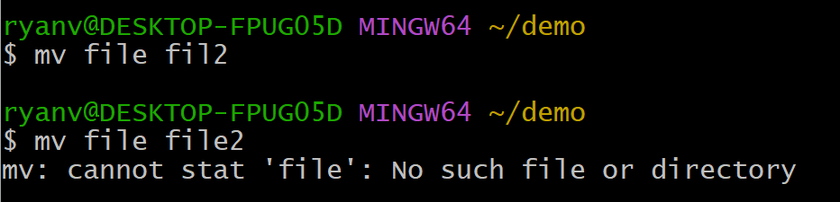

## 17. rm file2
Removes "file2."

## 18. clear
Clears the terminal.

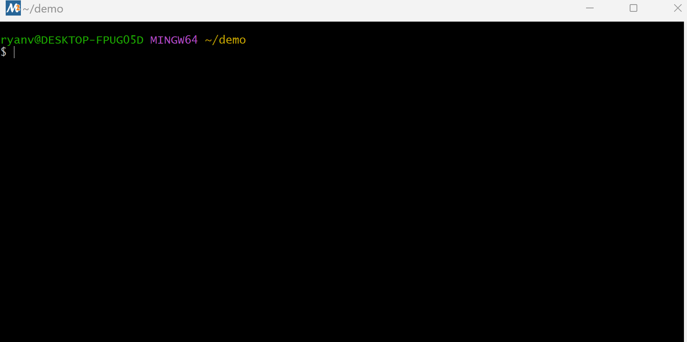

## 19. man uname
Opens a manual within the terminal to use the command "uname."

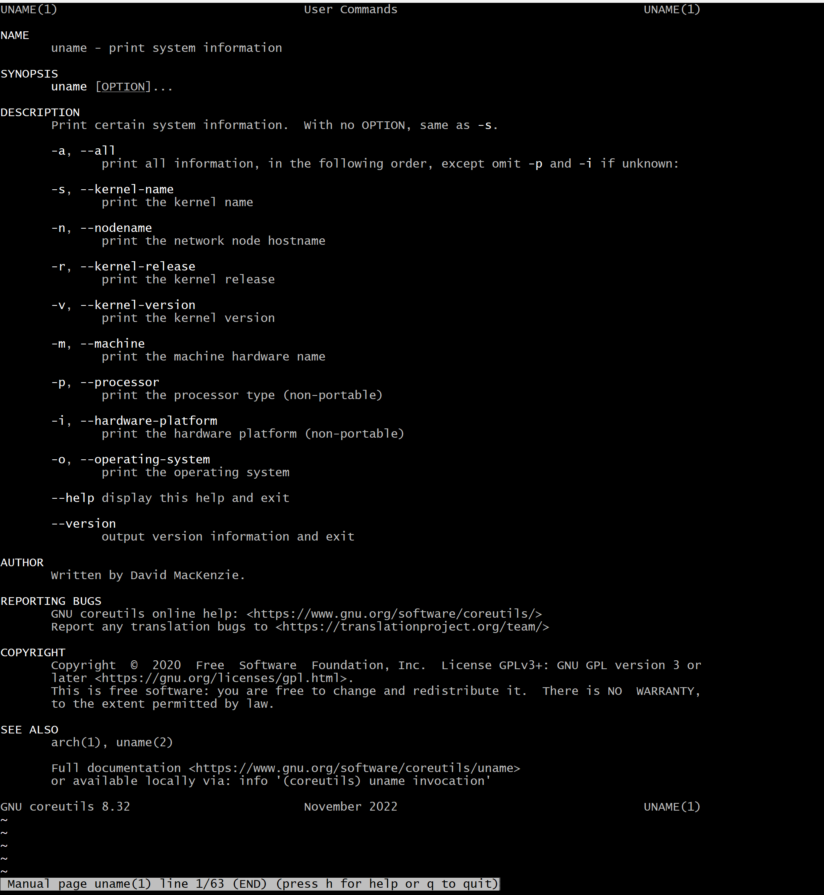

## 20. uname -a
Prints system info.

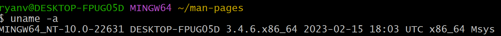

## 21. ifconfig
Prints info about IP configuration.

## 22. ping localhost
Sends ICMP echo request messages to another local computer.

## 23. netstat
Displays protocol statistics and current network connections. 
