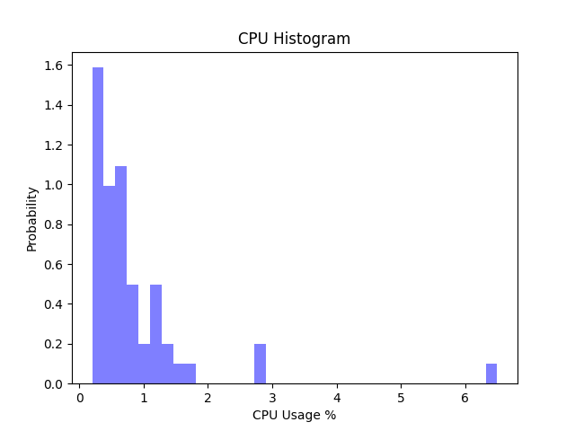

# CPE 322 Lab 8: Data Analysis

# plt_final.py

### Time Series

### Histogram CPU Usage

### Histogram of Memory

### Horizontal Box Plot of CPU Usage

### Vertical Box Plot of Memory

### Scatter Plot with Regression Line of CPU Usage

# plt_cv2.py

